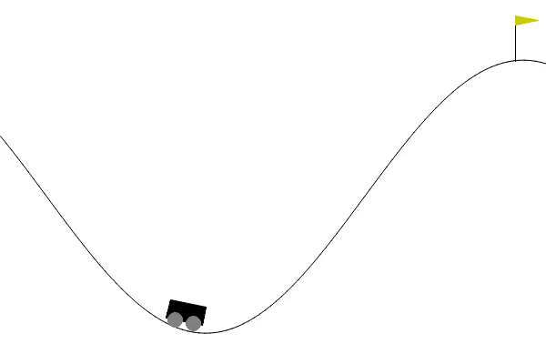

# Novelty Search - Evolution Strategy in Deep Reinforcement Learning

- Trong các bài toán Reinforcement Learning, mục tiêu của Agent là *cực đại hóa hàm phần thưởng*. Tuy nhiên, hàm phần thưởng có thể gây nhầm lẫn (bẫy) hoặc khan hiếm, khiến Agent kẹt ở điểm tối ưu cục bộ.

- Các giải pháp hiện đại thúc đẩy agent đến các trạng thái hiếm hoặc *chưa được khám phá* → khuyến khích khám phá (exploration)

- Một hướng tiếp cận khác là thiết kế hoặc học một mô tả về hành vi trong suốt lifetime của agent và thực hiện khám phá bằng một *quần thể các Agent*. Ví dụ: **Novelty Search (NS)** và **Quality Diversity (QD)**

---- 

# Các phương pháp tiếp cận

- Dựa trên nền tảng của Evolution Strategy và Novelty Search, phương pháp **NS-ES** được đề xuất:

- Các phương pháp khác được phát triển từ NS-ES để cải thiện kết quả, bao gồm:
  - NSR-ES: Lấy ý tưởng từ NS-ES nhưng bổ sung tín hiệu phần thưởng
  - Bài viết gốc về NS-ES và NSR-ES xem tại [paper](https://proceedings.neurips.cc/paper_files/paper/2018/hash/b1301141feffabac455e1f90a7de2054-Abstract.html)
- Dựa trên NS-ES, kết hợp với ý tưởng của giải thuật di truyền (GA), 2 thuật toán khác được đề xuất, bao gồm:
  - NS-ES customized: Tiến hành huấn luyện theo từng quần thể (thay vì theo vòng lặp như NS-ES).
  - NSR-ES customized: Lấy ý tưởng từ NS-ESc nhưng sử dụng tín hiệu phần thưởng.

# Kết quả
- Thực hiện đánh giá trên 3 môi trường, bao gồm *MountainCar*, *CartPole* và *BreakoutNoFrameskip-v4* và so sánh với thuật toán DQN.

- Thuật toán NSR-ESc mặc dù kết quả thấp hơn DQN nhưng có tốc độ huấn luyện nhanh nhất và cho kết quả khá tốt, cho thấy tiềm năng để ứng dụng chiến lược *tìm kiếm tính mới* và *các thuật toán tiến hóa* để giải quyết các bài toán học tăng cường.

- Kết quả thực nghiệm trên môi trường *MountainCar* được thể hiện trong bảng bên dưới. Kết quả chi tiết xem tại file `Slide.pdf`. 

  

